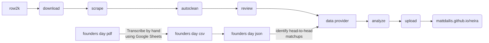

# neira
http://mattdailis.github.io/neira/

This is a project to help coaches and rowers keep track of how their school is doing compared to other schools in the NEIRA conference.

# Prerequisites
- python >= 3.8
- npm (recommend using nvm to install)

# Installation process
1. Make a virtualenv
2. In that environment, pip install -e .
3. cd neira_ui
4. npm install

# Updating data
Data is updated following this process:
1. Download data from row2k. This saves data in a local `data/0_raw` directory
2. Read from the `data/0_raw` directory and apply an automated cleaning process. This matches the schools in the data with known schools in NEIRA, and determines genders and classes if it can.
3. Guide a human reviewer through reviewing and correcting the cleaned data. This is an interactive process run by the `review.py` script.
4. Apply the corrections to `data/1_cleaned`, and produce data in `data/2_reviewed`.
5. Run any analyses that depend on this data, and save their output to `neira_ui/static`, where it can be included in the website.

Here are the commands needed for the above process. See the Corrections documentation for help with the review process.

```bash
neira scrape --refresh
neira review
neira apply-corrections

neira dot data/2_reviewed neira_ui/static/dot

neira head-to-head neira_ui/static/tables

cd neira_ui
npm run build
cd ..
rm -rf docs
mv ./neira_ui/build docs

git commit
git push
```

# Corrections
In order to ensure the validity of the data prior to running any analyses, there is a manual review step after the
automated cleaning process is complete. Corrections are made by adding an entry to `corrections.json`, where the key
is the uid of the race (found in the url of the race on row2k), and the value includes a `corrections` list, as well
as a `checksum` to be used to determine whether any races need to be re-reviewed due to upstream changes.

The `corrections` list contains a list of json objects, each of which has a `type` member. The value of `type` determines what other members are expected.

## "type": "comment"

This "correction" does not make any changes, but gives a space for the reviewer to add notes for themselves.

Example:
```json
{
    "type": "comment",
    "comment": "This race seems strange, I'd like to come back and look at it more closely"
}
```

## "type": "set_class_all_heats"

Overrides the `class` attribute on every heat with whatever the reviewer specifies. Useful for races where the automated cleaner could not determine whether the race included fours or eights.

Example:
```json
{
    "type": "set_class_all_heats",
    "class": "fours"
}
```

## "type": "set_gender_all_heats"

Overrides the `gender` attribute on every heat with whatever the reviewer specifies. Useful for races where the automated cleaner could not determine whether the race included boys or girls teams.

Example:
```json
{
    "type": "set_gender_all_heats",
    "class": "girls"
}
```

## "type": "ignore_heats"

Sometimes, heats are included in a race, but include only novice boats, or are mentioned in the race's comment as not valid for seeding. This correction allows those heats to be removed from the data. Note that the correction will fail to be applied if the heat does not exist. Heats are specified by mentioning a gender and a varsity index.

Example:
```json
{
    "type": "ignore_heats",
    "heats": ["girls 4", "boys 3"]
}
```

## "type": "exclude_schools_from_heat"

If a heat includes a school that should not be included for seeding, this corrections can remove it.

Example:
```json
{
    "type": "exclude_schools_from_heat",
    "heat": "boys 2",
    "schools": ["Stonington", "BB&N"]
}
```

## "type": "set_margins"

If the timings for a heat are specified in a non-standard way, it's possible to override the computed margins. This correction does not support changing the order of the schools - if any school is out of order or missing, the application of this correction will raise an exception.

Example:
```json
{
    "type": "set_margins",
    "heat": "girls 4",
    "margins": [
        { "school": "Groton", "margin_from_winner": 0 },
        { "school": "Berkshire Academy", "margin_from_winner": 2.3 },
        { "school": "Thayer", "margin_from_winner": 4.1 },
    ]
}
```

# Hosting
This website is hosted on GitHub Pages. GitHub Pages allows for two options for hosting: dedicate a branch to be the hosted branch, or host from the `docs` folder of your main branch. This website is hosted from the `docs` folder.

# Architecture
- `neira/scrape`: a python package responsible for downloading data from row2k and cleaning it
- `neira/dot`: python program that generates graphviz visualizations based on downloaded data
- `neira_ui`: user interface code, using svelte framework



### row2k
Coaches input race results into row2k

### download
Save a local copy to disk for further analysis

### scrape
Identify the pertinent information in the downloaded html. This does not interpret the data, but pulls it out into a non-html form

### autoclean
Auto cleaning does the most interpretation of any other step. Its primary functions are:
- Identify the schools in each heat. This includes fuzzy matching against a list of known schools
- Remove any non-NEIRA schools from the heat. This data is only meant for NEIRA seeding
- If the same school appears in a heat twice, take the better time. This is usually (but not always) enough to remove cases where a school races both their 2nd and 3rd boats in the same heat.
- Identify whether this is a boys heat or a girls heat - this is either done by looking at the title (which may say "NEIRA Boys Fours"), or by looking at the html ("Mens Racing" and "Womens Racing")
  - Sometimes, neither of those strategies works. The clean step may give up and say that the gender is unknown - it is expected to be provided in the "review" step
- Identify whether this is a fours heat or an eights heat. This is always done by looking at the title. If that information is not in the title, leave it as "unknown" and expect it to be provided in the "review" step
- Compute the margins between schools in a heat. Clients of data should use the margins rather than the raw times, although both are provided

### review
After autoclean, all data is reviewed by a human. The primary task here is to read the coach's comment, and determine of any heats should be ignored, or schools should be disqualified. The reviewer is also expected to specify "boys" or "girls", and "fours" or "eights", if autoclean couldn't determine this. This is typically done by looking at the schools that competed, and checking neiraschools.py to see if those schools compete in "fours" or "eights", and if any of the schools compete only in "boys" or "girls" categories.

### analyze
Once the data has been scraped, cleaned, and reviewed, it is considered ready for analysis. This may involve building table views, or graphs.

### upload
The data is uploaded to mattdailis.github.io/neira for display.

## Founders Day
Founders day is different from other races for two reasons:
1. Its data is provided in a pdf, rather than the standard row2k form
2. It has seprate heats and finals, which impact seeding in a nuanced way

This is the policy for how Founders Day data is accounted for in seeding:
> We consider all head-to-head matchups between all pairs of neira schools except: when two schools raced each other twice, the heat is ignored and only the final counts for seeding
> 
> Consequently, we do not compare any schools that did not race head to head. E.g. if school A from heat 1 made the finals, and school B from heat 2 did not make the finals, we cannot compare school A to school B because they did not race head to head

# Glossary
- **varsity index**: A number from 1 to 6, referring to a school's "first boat" through "sixth boat".
- **gender**: Either `boys` or `girls`
- **class**: Either `eights` or `fours`
- **boat**: A combination of *school*, *gender*, *varsity index* and *class*. For example: `Groton Girls Second Four`, or `("fours", "girls", "2", "Groton")`
- **race**: A page on row2k. A race may contain multiple heats
- **heat**: A set of boats that competed simultaneously
- **head-to-head**: A term for comparing boats by using their performance relative to each other in the same heat
